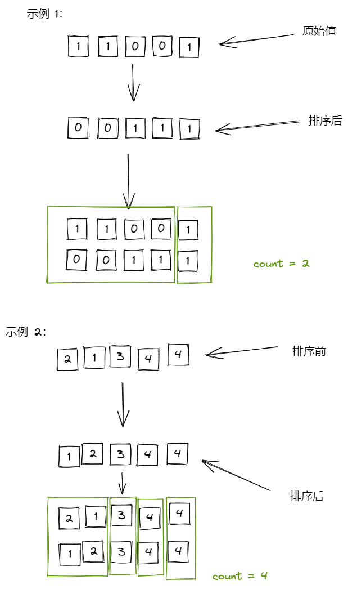

# **768. 最多能完成排序的块 II**

https://leetcode-cn.com/problems/max-chunks-to-make-sorted-ii/

## 思路

* 拷贝一份数组然后排序，排序前的数减去排序后的数据累加，计算等于0的次数，就是要返回的结果

### 图解



#### 说明：

* 从 l ~ r 的一段切片中，原始值与排序后的值是一样的，分为一段，相减也为0 

### js

``` js
/**
 * @param {number[]} arr
 * @return {number}
 */
var maxChunksToSorted = function (arr) {
  const copeArr = arr.slice(0, arr.length)
  copeArr.sort((a, b) => a - b)

  let num = 0
  let count = 0
  for (let i = 0; i < arr.length; i++) {
    num += (arr[i] - copeArr[i])
    if (num === 0) count++
  }
  return count
};
```

### 复杂度分析

* 时间复杂度：O(n) n为数组的长度
* 空间复杂度：O(n)